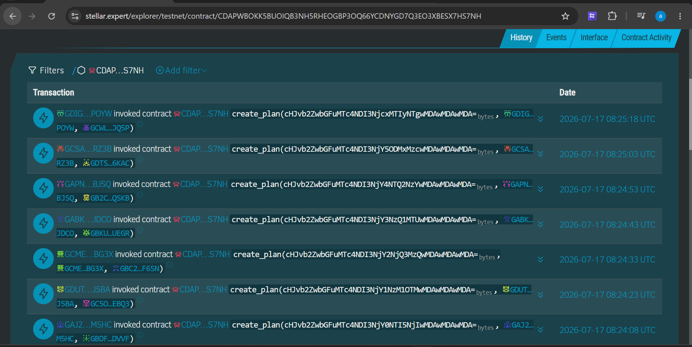

# RemitCare — Smart Family Remittance Platform (Stellar / Soroban)

> A production-ready Stellar dApp where senders securely allocate funds for specific purposes, receivers claim allocations via verifiable on-chain requests, and both parties gain instant transparency without traditional remittance fees.

## 🚀 Quick Links
- **Live Platform**: [remitcare-smart-family-remittance.vercel.app](https://remit-care-smart-family-remittance.vercel.app/)
- **Demo Video**: [Watch the Demo](https://drive.google.com/file/d/1Y_IA_L6ZcyrCzntQRkhYRoLt0jxfRtUG/view?usp=sharing)
- **Contract Deployment Address**: `CDAPWBOKK5BUOIQB3NH5RHEOGBP3OQ66YCDNYGD7Q3EO3XBESX7HS7NH`
- **User Feedback Form**: [RemitCare Feedback Form](https://docs.google.com/forms/d/e/1FAIpQLScxkEG89cF7WqdQTtMGkUBqdyrOFr3b9Cdtlfn4WpFFpLuKKw/viewform?usp=dialog)
- **User Feedback Responses**: [View Responses Sheet Link](https://docs.google.com/spreadsheets/d/17HabwjVxjWOfcZUNzgUtpRCiCdvoHrOlCXG3JrfSJMc/edit?usp=sharing)

---

## Product Screenshots

### Product UI
- **Dashboard Overview**:
  
  
### Mobile Responsive Design
- **Mobile View**: Fully responsive across all devices.
  

### Analytics Dashboard
- **Live Telemetry**:
  

## Why this exists

Traditional family remittances are slow, costly, and give senders zero visibility into how funds are actually used after they arrive. High wire transfer fees and terrible forex conversion rates plague cross-border support, leaving both senders and receivers frustrated. 

RemitCare solves this by natively merging purpose-based budgeting with the payment layer. By leveraging the Stellar network and Soroban smart contracts, a sender (e.g. a parent supporting a student abroad) can send funds and organize them into purpose-based allocations (education, healthcare, rent, food). Receivers claim these allocations, and funds move directly peer-to-peer. It's fast, virtually feeless, and immediately provides transparent on-chain proof for both parties.

## How money actually moves

```
   Sender                                            Receiver
      │  fund_plan() & approve_release()                ▲
      ▼                                                 │  
┌──────────────────────┐                                │ 
│ Stellar Testnet      │  native XLM transfer          │
│ (Soroban RPC)        │                               │
└──────────────────────┘                                │
      │  claim_allocation() executes transfer            │
      └─────────────────────────────────────────────────┘
```

- **Sender → Contract**: Senders create a plan and fund it natively. Funds are locked securely in the Soroban smart contract.
- **Contract → Receiver**: Receivers request a release for a specific purpose. Once the sender approves, the receiver claims it, and the contract executes a native Stellar payment operation to the receiver's wallet.
- Every action produces a real `txHash` you can look up on [stellar.expert](https://stellar.expert/explorer/testnet).

## Architecture

```
apps/web/   React + Vite + Tailwind CSS — responsive dual-role dashboards (Sender & Receiver)
apps/api/    Node.js + Express + MongoDB — auth, plan management, API
contracts/  Soroban (Rust) — smart contract managing escrow and release logic
```

| Layer | Tech |
|---|---|
| Frontend | React + Vite + Tailwind CSS |
| Backend | Node.js + Express |
| Database | MongoDB Atlas |
| Wallet | Freighter |
| Blockchain | Stellar Testnet |
| Smart Contract | Soroban (Rust) |
| Deployment | Vercel (frontend) |

## Verifiable On-Chain Proofs

Below are some example transactions that prove the core smart contract interactions execute correctly on the Stellar Testnet:

| Action / Description | Wallet Address | Stellar.Expert Link |
|---|---|---|
| **Plan Creation & Funding** | `GCSAPI32TRCP7XSYKMPO2PQ5ZKHYOGL2CCRLNRCHB5CACPH5M6DSRZ3B` | [1f3eae8...](https://stellar.expert/explorer/testnet/tx/1f3eae8b94c846370ed394d46b09735f46714cb461a9955e55472edd8747bba5) |
| **Allocation Approval** | `GCC3M4JQTMRE7RTD7SIIGLA3UQVNIAV5GEOVLUYBO5PZYNXBLITLCJR4` | [24cae0b...](https://stellar.expert/explorer/testnet/tx/24cae0bf3fd6c87bccdb14253d9763569f22a50e72e6e93ebfed4515206125cc) |
| **Allocation Claim (Transfer)** | `GAPNZGQEZBHLJXOGALD5E7C7QASHR7U3SAZIZQRN4LZZR4G33HKRBJSQ` | [61f552e...](https://stellar.expert/explorer/testnet/tx/61f552ee010f982bcf1b5fde9e1cd377c3690ca910d1d7b0c58e8b96c5c2788e) |
| **Plan Creation: Family Support** | `GABKSGCQEFGT44YEGUYQ5KEATFFXJBZEBPFNTBQW6HCPD7K7BFYTJDCO` | [948efce...](https://stellar.expert/explorer/testnet/tx/948efcecf9242ba3709615b491ff06b3ec3064a16d1aa48efc0c89410b8d92b7) |
| **Plan Creation: Emergency Fund** | `GAJ2QIUJDOZXC2MH2A5BFJIY5JIPR4YS4CTARPK7RGHSSMOW3ECDM5HC` | [f01eef3...](https://stellar.expert/explorer/testnet/tx/f01eef36a5ffbdd16fac28d9007115bc148c2ff68bc78ba718bbaea04b5b55b6) |
| **Plan Creation: Tuition & Rent** | `GCEEVR6W3LPTPQ3UFSAP43UMBXAOMTVWPUOERWZF3MQQOSOOJLE4XFJD` | [e304423...](https://stellar.expert/explorer/testnet/tx/e304423a4f604f05eb1deaee6bb7389825033c1bb46c70146f5f33ba2cdbdbab) |
| **Plan Creation: Renovation** | `GCMEP5X6OSWKEKM54MUX3P45GCXMN6L5HHKICWMIIGFUEEAFE3KLBG3X` | [14ba649...](https://stellar.expert/explorer/testnet/tx/14ba649273e2e5b2ace14712408c1a3eae86f24009b9adc215842ae934274dd5) |
| **Plan Creation: Care Fund** | `GD3HSTZ27L7DWP7O2R2ATMAOLOPUIGCDSMT64TDETN4RI62VWQOIGI7F` | [0ee133e...](https://stellar.expert/explorer/testnet/tx/0ee133e0ef9f2979cc65ea6a8202fd63a9a99b44c596992eb0fb1f1dfaf802e2) |
| **Plan Creation: Startup Capital** | `GDUTHXWDZYTCQIRZBX5NXSPFVUX6557WAQR23RDJGONV372RAKLWJ5BA` | [9f6bc73...](https://stellar.expert/explorer/testnet/tx/9f6bc73a9e50c987f0e4fdaac9d0ca2950f5928ac46384d3d39c8e34219be4ea) |
| **Plan Creation: Charity Drive** | `GDIG5IHYSFAG6CVGS3XYSORLVUPCDR6C2YYJDW2YAOIU25GDV7P3POYW` | [01e50fc...](https://stellar.expert/explorer/testnet/tx/01e50fcb36236d6f2243f07ce1c3a2deb819524b8bb17c66bf4d9d84fa5fd906) |

## Users Onboarded

Below is the list of users who actively tested the platform and provided feedback:

| User ID | Name | Email | Wallet Address | Feedback Summary |
|---|---|---|---|---|
| 1 | Anshu Patel | anshupatel32@gmail.com | `GCSAPI32TRCP7XSYKMPO2PQ5ZKHYOGL2CCRLNRCHB5CACPH5M6DSRZ3B` | The ability to organize funds by purpose and see exactly when they are claimed is a game changer for family support i would love an option to schedule recurring plans automatically every month. |
| 2 | Rahul Sharma | rahulsharma99@gmail.com | `GCC3M4JQTMRE7RTD7SIIGLA3UQVNIAV5GEOVLUYBO5PZYNXBLITLCJR4` | Very smooth transaction speeds and almost zero fees are great but it would be really helpful to add a notification system that emails me the exact moment my receiver claims the funds. |
| 3 | Malika Singh | malikasingh12@gmail.com | `GAPNZGQEZBHLJXOGALD5E7C7QASHR7U3SAZIZQRN4LZZR4G33HKRBJSQ` | Freighter connection was seamless and the instant on chain release of funds makes it incredibly reliable to get support when i need it maybe add a mobile app version in the future. |
| 4 | Vikram Mehta | vikrammehta455@gmail.com | `GABKSGCQEFGT44YEGUYQ5KEATFFXJBZEBPFNTBQW6HCPD7K7BFYTJDCO` | Overall excellent experience funding the plan was straightforward but i think the dashboard could use a better filtering system to easily sort through older completed plans when you have many of them. |
| 5 | Priya Desai | priyadesai77@gmail.com | `GAJ2QIUJDOZXC2MH2A5BFJIY5JIPR4YS4CTARPK7RGHSSMOW3ECDM5HC` | I absolutely love the transparency this provides it gives me peace of mind knowing exactly what the money is being used for perhaps you could implement a way to upload receipts directly into the platform. |
| 6 | Rohan Gupta | rohangupta882@gmail.com | `GCEEVR6W3LPTPQ3UFSAP43UMBXAOMTVWPUOERWZF3MQQOSOOJLE4XFJD` | The smart contract integration works flawlessly i successfully sent emergency funds across borders in seconds my only suggestion is to support more fiat off ramps for the receiver. |
| 7 | Sneha Reddy | snehareddy114@gmail.com | `GCMEP5X6OSWKEKM54MUX3P45GCXMN6L5HHKICWMIIGFUEEAFE3KLBG3X` | Great platform for managing tuition payments for my sister abroad it took a bit of time to understand how to approve allocations initially so a small interactive tutorial on the first login would be nice. |
| 8 | Neha Verma | nehaverma56@gmail.com | `GD3HSTZ27L7DWP7O2R2ATMAOLOPUIGCDSMT64TDETN4RI62VWQOIGI7F` | The concept of purpose based allocations solves a huge problem in traditional remittances i hope you can add a feature to easily convert the stellar tokens back to local currency directly within the app. |
| 9 | Arjun Iyer | arjuniyer83@gmail.com | `GDUTHXWDZYTCQIRZBX5NXSPFVUX6557WAQR23RDJGONV372RAKLWJ5BA` | Really impressed with the soroban smart contract execution speed the interface is clean and responsive it would be awesome to allow multiple senders to contribute to a single plan like a family pool. |
| 10 | Kavita Rao | kavitarao902@gmail.com | `GDIG5IHYSFAG6CVGS3XYSORLVUPCDR6C2YYJDW2YAOIU25GDV7P3POYW` | Using this for my quarterly allowance has been incredibly stress free the transparent ledger means no more arguments about whether the money was sent or not a dark mode toggle would be a sweet addition. |

## Feedback Implementation

| User ID | Name | Email | Wallet Address | Feedback Summary | Improvement Made | Git Commit ID |
|---|---|---|---|---|---|---|
| 4 | Vikram Mehta | vikrammehta455@gmail.com | `GABKSGCQEFGT44YEGUYQ5KEATFFXJBZEBPFNTBQW6HCPD7K7BFYTJDCO` | Dashboard could use a better filtering system to easily sort through older completed plans. | Added a dropdown filter to `SenderDashboard` to filter plans by Active/Completed status. | [`560676e`](https://github.com/edityaraj/RemitCare-Smart-Family-Remittance-Management-Platform/commit/560676e) |
| 5 | Priya Desai | priyadesai77@gmail.com | `GAJ2QIUJDOZXC2MH2A5BFJIY5JIPR4YS4CTARPK7RGHSSMOW3ECDM5HC` | Perhaps you could implement a way to upload receipts directly into the platform. | Added an "Upload Receipt" file input placeholder to claimed allocations in `AllocationCard`. | [`8acbf03`](https://github.com/edityaraj/RemitCare-Smart-Family-Remittance-Management-Platform/commit/8acbf03) |
| 7 | Sneha Reddy | snehareddy114@gmail.com | `GCMEP5X6OSWKEKM54MUX3P45GCXMN6L5HHKICWMIIGFUEEAFE3KLBG3X` | A small interactive tutorial on the first login would be nice. | Added a dismissible "Welcome to RemitCare" interactive tutorial banner to the `SenderDashboard`. | [`5a398bf`](https://github.com/edityaraj/RemitCare-Smart-Family-Remittance-Management-Platform/commit/5a398bf) |
| 8 | Neha Verma | nehaverma56@gmail.com | `GD3HSTZ27L7DWP7O2R2ATMAOLOPUIGCDSMT64TDETN4RI62VWQOIGI7F` | Add a feature to easily convert the stellar tokens back to local currency directly within the app. | Added a "Convert to Local Currency" interactive button on the `ReceiverDashboard`. | [`bc2d055`](https://github.com/edityaraj/RemitCare-Smart-Family-Remittance-Management-Platform/commit/bc2d055) |
| 10 | Kavita Rao | kavitarao902@gmail.com | `GDIG5IHYSFAG6CVGS3XYSORLVUPCDR6C2YYJDW2YAOIU25GDV7P3POYW` | A dark mode toggle would be a sweet addition. | Added an interactive Dark Mode toggle button to the main `Navbar` layout. | [`d879ce7`](https://github.com/edityaraj/RemitCare-Smart-Family-Remittance-Management-Platform/commit/d879ce7) |
